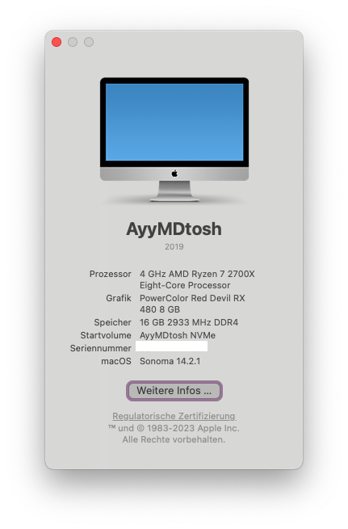
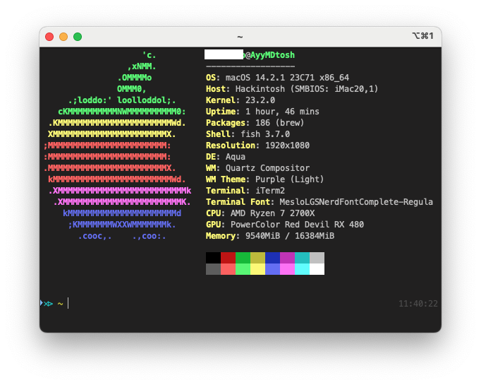

## AyyMDtosh

Current OS: macOS 13.1 Ventura + Windows 11 22H2

[OCSysInfo](https://github.com/KernelWanderers/OCSysInfo) dump can be found in this same folder, below will be a hardware profile done by myself

```ini
[██████████████████████████████]
AyyMDtosh:
╟➼ Motherboard: Asus TUF Gaming X470 Plus
║░░├ Socket: AM4
║░░╰ Chipset: X470
╟➼ CPU: AMD Ryzen 7 2700X Processor
║░░├ 8 Cores / 16 Threads
║░░╰ Clock Speed: 4GHz
╟➼ RAM: 16GB DDR4 3000MHz
║░░╰ Model: Corsair VENGEANCE® LPX 16GB (2 x 8GB) DDR4 DRAM 3000MHz C16 Memory Kit - Black
╟➼ NIC: Realtek RTL8111H
║░░╰ Max link speed: 1Gbps
╟➼ WiFi/Bluetooth: Fenvi FV-HB1200
║░░├ Bluetooth: 4.0
║░░╰ WiFI: 2.4GHz + 5GHz
╟➼ GPU: AMD Radeon RX 480 8GB (PowerColor Red Devil)
║░░├ VBIOS: Modified RX 580 VBIOS
║░░╰ PCI ID: [1002:67df]
╟➼ Storage
║░░├ Sabrent Rocket 512GB (Revision RKT343.1 according to macOS)
║░░╰ WD Blue 2TB HDD (WDC WD20EZRZ-00Z5HB0)
╟➼ Audio: Realtek ALC887
╟➼ PSU: be quiet! System Power 9 700W
[██████████████████████████████]
```

