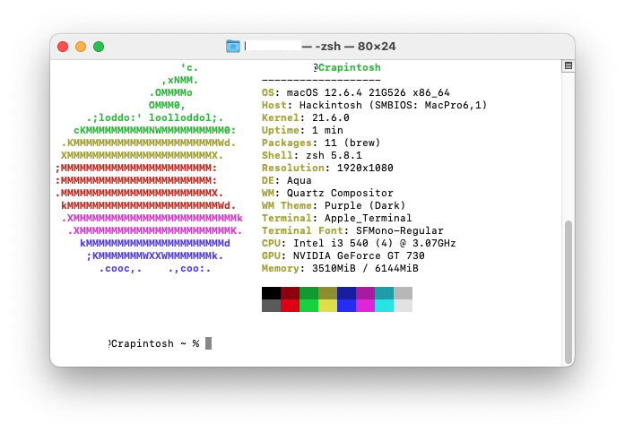

## Crapintosh | Acer Aspire X3900/X5900

Current OS: Windows 8.1

### No macOS install currently

[OCSysInfo](https://github.com/KernelWanderers/OCSysInfo) dump can be found in this same folder, below will be a hardware profile done by myself

```ini
[██████████████████████████████] 
Crapintosh | Acer Aspire X3900/X5900:
╟➼ Motherboard: Acer Aspire H57D01-1.0-8EKS3H
║░░├ Socket: LGA 1156
║░░╰ Chipset: H57
╟➼ CPU: Intel Core i3-540
║░░├ Codename: Clarkdale
║░░├ 2 Cores / 4 Threads
║░░╰ Clock Speed: 3GHz
╟➼ RAM: 3x Kingston ACR256X64D3U1333C9
║░░├ Size: 2GB (All 3 together: 6GB)
║░░╰ Speed: 1333MHz
╟➼ WiFi/Bluetooth: Fenvi FV-T919
║░░├ WiFi: 2.4GHz + 5GHz
║░░╰ Bluetooth: 4.0
╟➼ NIC: Intel 82578DC Gigabit Ethernet Controller
╟➼ GPU: MSI GT 730
║░░├ Codename: Kepler
║░░╰ Memory Size: 2GB
╟➼ Storage
║░░╰ Verbatim Vi550 S3 512GB SSD (SATA 2 only because of Motherboard support)
╟➼ Audio: Realtek ALC888
╟➼ PSU: LITEON PS-5221-09 AE ROHS
[██████████████████████████████]
```

